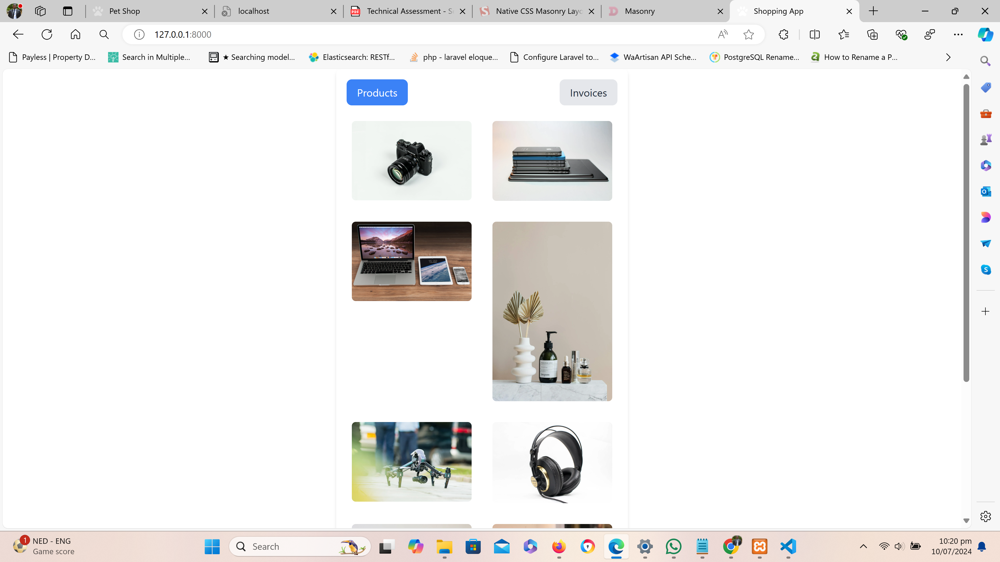

# Fullstack Shopping App Task
A fullstack application built with Laravel (on the backend) and Vue.js (on the frontend)

## Project Setup
1. **Create .env File**: Create a file in the root directory and name it `.env`. Copy the content from the `.env.example` and paste into `.env`, and save it.

2. **Install Composer Dependencies**: Run the command

    ```bash
    composer install
    ```

3. **Install NPM Dependencies**: Run the command

    ```bash
    npm install
    ```
4. **Create Database**: Create a database (MySql DB preferably) and name it exactly as specified in the `.env` file "shopping_app".

5. **Migrate Database**: Run the following command to populate your database with the necessary tables:

    ```bash
    php artisan migrate
    ```

6. **Run Seeder**: Run the command below to populate the products, invoices and invoice_items tables with some data for easy testing

    ```bash
    php artisan db:seed
    ```

## Run Project
1. Run the following commands in two separate terminals

    ```bash
    php artisan serve
    ```

    ```bash
    npm run dev
    ```
Copy the url generated from `php artisan serve` command and paste it in a browser.


## Application Screenshots


